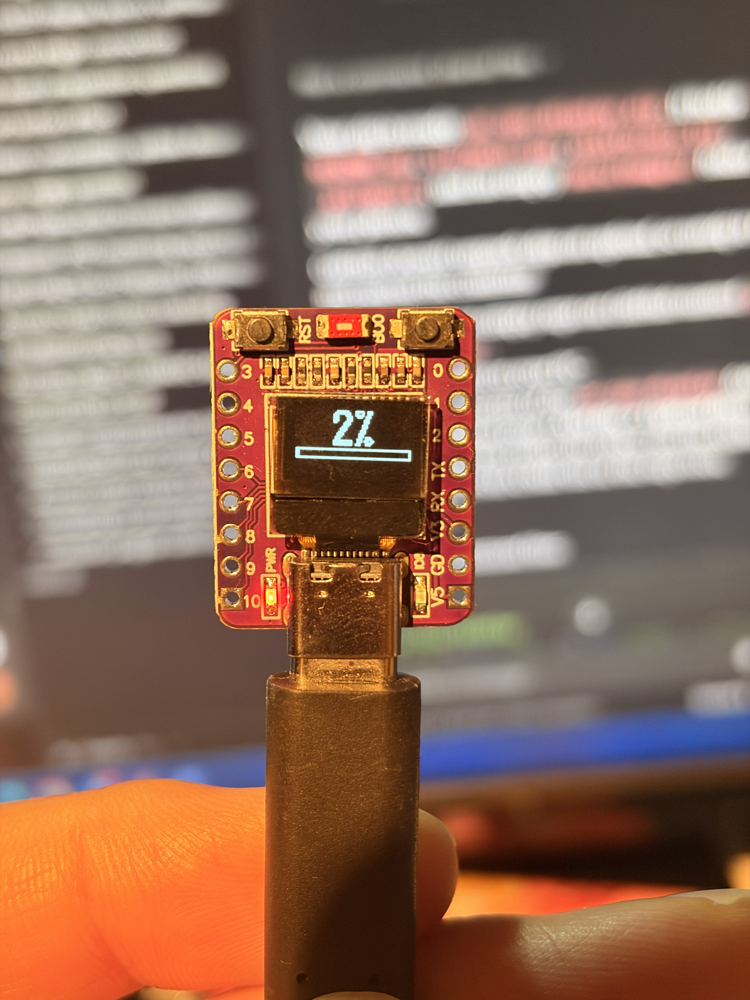
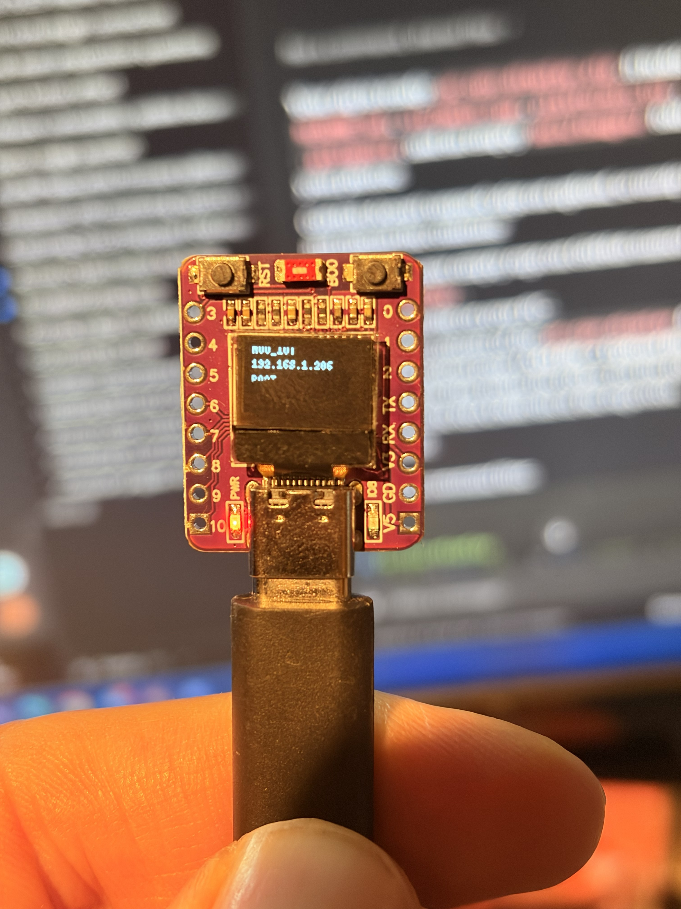
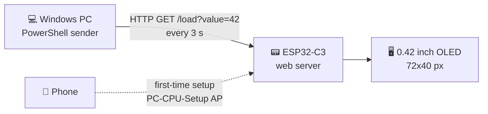

<div align="center">

# 📟 PC CPU Display

**See your Windows PC's CPU load on a tiny OLED, over Wi-Fi.** ⚡

[](https://www.espressif.com/en/products/socs/esp32-c3)
[](https://github.com/espressif/arduino-esp32)
[](https://platformio.org/)
[](https://learn.microsoft.com/powershell/)




</div>


---

## 📖 Table of contents

- [✨ What is this?](#-what-is-this)
- [🧰 What you need](#-what-you-need)
- [🚀 Quick start](#-quick-start)
- [🎮 How to use it](#-how-to-use-it)
- [🧠 How it works](#-how-it-works)
- [🌐 HTTP API](#-http-api)
- [🔌 Pinout](#-pinout)
- [🛠️ Troubleshooting](#️-troubleshooting)
- [🔒 Security notes](#-security-notes)
- [🗂️ Project structure](#️-project-structure)
- [🤝 Contributing](#-contributing)
- [📄 License](#-license)

---

## ✨ What is this?

A small desk gadget: an **ESP32-C3 board with a built-in 0.42" OLED** shows your **Windows PC's live CPU usage**. A tiny background script on your PC sends the number every **3 seconds** over your normal home Wi-Fi.

**Highlights**

- 🔢 Big, centered **CPU percentage**
- 📊 Thick **load bar** along the bottom (stays inside the screen margins, 0–100%)
- 🔘 **BOOT button** switches between the CPU view and the **Wi-Fi name + IP address** view
- 📱 **Phone-based Wi-Fi setup**: no passwords hard-coded in the firmware
- 💾 Wi-Fi credentials are saved **on the ESP32**, not in the source code
- 🪄 **One-click Windows installer** served by the device itself
- 🔌 Powered by **plain USB**, no wiring, no extra parts

---

## 🧰 What you need

| | Item | Notes |
|---|---|---|
| 🧩 | **ESP32-C3 0.42" OLED dev board** | ABRobot / "Super Mini" style, built-in SSD1306 |
| 🔌 | **USB cable + USB power** | Power only, no data link to the PC needed after flashing |
| 💻 | **Windows PC** | PowerShell 5.1 or newer |
| 📶 | **Home Wi-Fi** | The PC and the display must be on the same network |
| 🛠️ | **[PlatformIO](https://platformio.org/)** | To build and flash the firmware |

---

## 🚀 Quick start

### 1️⃣ Flash the firmware

```bash
git clone https://github.com/<your-username>/pc-cpu-display.git
cd pc-cpu-display
pio run -t upload
```

> 📦 The only library is [U8g2](https://github.com/olikraus/u8g2) `^2.36.15`. PlatformIO installs it for you.

### 2️⃣ Connect the display to Wi-Fi 📱

1. Plug the board into USB power.
2. On your phone, join the Wi-Fi network **`PC-CPU-Setup`**
3. Password: **`cpu-display-42`**
4. The setup page opens by itself. If not, go to 👉 **http://192.168.4.1**
5. Enter the name and password of the **same Wi-Fi your PC uses**.
6. The board restarts, joins your network and shows its **IP address** on screen. ✅

### 3️⃣ Install the Windows sender 💻

1. On your PC, open the address shown on the display, followed by `/sender`.
   Example: **`http://192.168.1.50/sender`**
2. Run the downloaded **`Install-PC-Cpu-Display.ps1`**.
3. Test right away (no need to sign out):

```powershell
Start-ScheduledTask -TaskName "PC CPU Display Sender"
```

🎉 Your CPU load should show up within about **3 seconds**. From now on the sender starts automatically when you sign in (scheduled task: **PC CPU Display Sender**).

<details>
<summary>🗑️ <b>How do I uninstall the sender?</b></summary>

```powershell
Unregister-ScheduledTask -TaskName "PC CPU Display Sender" -Confirm:$false
Remove-Item "$env:LOCALAPPDATA\PC-Cpu-Display-Sender.ps1"
```

</details>

---

## 🎮 How to use it

| You see | It means |
|---|---|
| **Big % + bar** | Everything works, live CPU load 🎯 |
| **WAITING FOR PC** | Connected to Wi-Fi, but the PC hasn't sent data yet ⏳ |
| **WI-FI SETUP** | No saved network (or it couldn't connect), so setup mode is active 📡 |
| **WI-FI / IP** | Info screen: network name and device IP 🌐 |

| You do | Result |
|---|---|
| Press **BOOT** once | Toggle **CPU view ⇄ Wi-Fi/IP view** 🔘 |
| Open `http://<display-ip>/reset` | Forget Wi-Fi and return to setup mode 🔄 |

> ⏱️ If the saved Wi-Fi can't be joined within **20 seconds** at boot, the board falls back to setup mode automatically.

---

## 🧠 How it works



- The **PC** reads the total CPU load with a Windows performance counter and sends it to the display.
- The **ESP32** runs a small web server, draws the value with [U8g2](https://github.com/olikraus/u8g2), and blinks its status LED on each update.
- The visible 72×40 glass is a window at offset **(30, 12)** inside the SSD1306's 128×64 RAM. The firmware redraws the whole controller buffer so no old pixels linger.

---

## 🌐 HTTP API

The device exposes a few simple endpoints, so you can also drive it from any script or tool:

| Endpoint | Method | What it does |
|---|---|---|
| `/` | GET | Status page (device IP, current load, reset link) |
| `/load?value=0..100` | GET / POST | Set the displayed load. Returns `{"ok":true,"cpuLoad":N}` or `400` on bad input |
| `/sender` | GET | Download the Windows installer script |
| `/reset` | GET | Clear saved Wi-Fi and reboot into setup mode |

```bash
# Try it from any machine on your network 🧪
curl "http://192.168.1.50/load?value=42"
```

---

## 🔌 Pinout

Everything is already wired on the board. Nothing to solder. 🙌

| Function | GPIO |
|---|---|
| 🖥️ OLED data (SDA) | `5` |
| 🖥️ OLED clock (SCL) | `6` |
| 💡 Status LED | `8` |
| 🔘 BOOT button (active low) | `9` |

---

## 🛠️ Troubleshooting

<details>
<summary>📱 <b>The setup page doesn't open on my phone</b></summary>

Open a browser and go to **http://192.168.4.1** manually.

</details>

<details>
<summary>⏳ <b>The display is stuck on "WAITING FOR PC"</b></summary>

- Are the PC and the display on the **same network**?
- Is **client/AP isolation** turned off on your router?
- Is the task there? `Get-ScheduledTask "PC CPU Display Sender"`
- Start it manually: `Start-ScheduledTask -TaskName "PC CPU Display Sender"`

</details>

<details>
<summary>📶 <b>I entered the wrong Wi-Fi details</b></summary>

Open `http://<display-ip>/reset`, or just wait: after **20 seconds** of failing to connect, the board goes back to setup mode on its own.

</details>

<details>
<summary>🤔 <b>I forgot the display's IP address</b></summary>

Press the **BOOT** button. The IP is on the Wi-Fi/IP screen.

</details>

---

## 🔒 Security notes

This is a hobby project for a **trusted home network**. Good to know:

- 🔑 The setup hotspot uses a **fixed default password** (`SETUP_AP_PASSWORD` in [`src/main.cpp`](src/main.cpp)). Change it before flashing if you like.
- 🌐 `/load`, `/sender` and `/reset` are **plain HTTP without authentication**. Don't use this on shared or public Wi-Fi.
- 💾 Wi-Fi credentials are stored in ESP32 flash (NVS) **unencrypted**.
- 📜 The installer is a PowerShell script fetched over HTTP from the device. It's short, so **read it before running it**.

---

## 🗂️ Project structure

```text
pc-cpu-display/
├── 📁 src/
│   └── main.cpp          # Firmware
├── 📁 docs/images/       # Photos used in this README
├── platformio.ini        # Build configuration
└── README.md
```

---

## 🤝 Contributing

Ideas, bug reports and pull requests are welcome! 💬
Open an [issue](../../issues) or submit a [pull request](../../pulls).

## 📄 License

Add a `LICENSE` file (for example [MIT](https://choosealicense.com/licenses/mit/)) and mention it here.

---

<div align="center">

Made with ❤️ and an ESP32 · ⭐ Star the repo if you find it useful!

</div>
